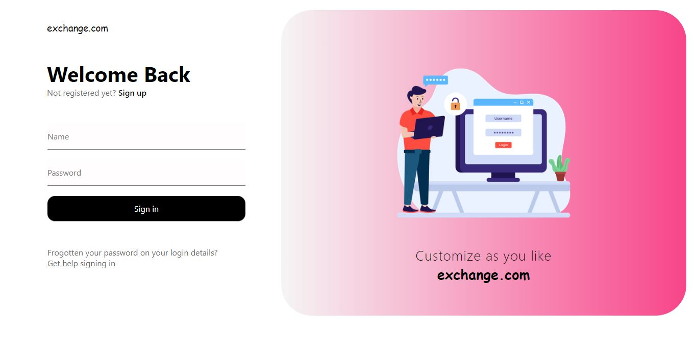

# exchange.com - Sign-In and Sign-Up Front-end Website

Welcome to Exchange.com, a front-end website for user sign-in and sign-up experiences! This project was developed using HTML, CSS, and jQuery to provide users with a seamless and secure authentication process.

## Features

- **Sign-In and Sign-Up:** Users can easily sign in to their accounts or create new ones for accessing the platform.

- **Sleek and Modern Design:** The website features a sleek and modern design that ensures an aesthetically pleasing user experience.

- **Responsive Layout:** Exchange.com is fully responsive, offering a consistent and optimized experience on various devices, including large screens.

- **Validation and Error Handling:** The sign-up and sign-in forms include client-side validation and error handling for a smooth user experience.

## Screenshots

## Live Demo

Try out the sign-in and sign-up experiences live by visiting [here](https://pathugit.github.io/login-website/).

## Installation

To run the website locally, follow these steps:

1. Clone the repository: `git clone https://github.com/pathuGIT/login-website.git`
2. Navigate to the project directory: `cd login-website`
3. Open `index.html` in your preferred web browser.

## Feedback

I'd love to hear your feedback and suggestions. If you encounter any issues or have ideas for improvements, please open an issue on the GitHub repository.

## License

This project is licensed under the [MIT License](LICENSE).
